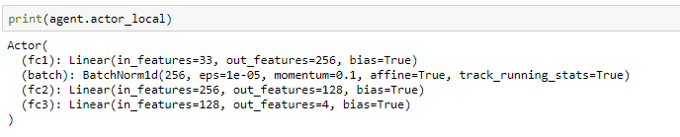
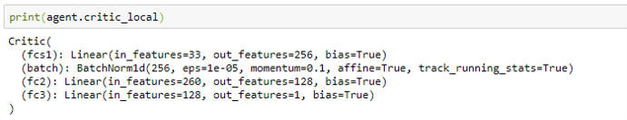
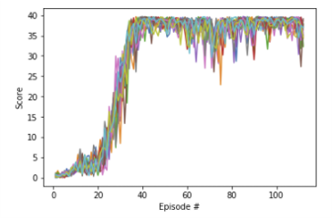
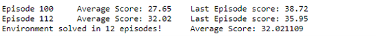
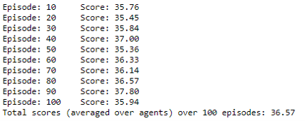
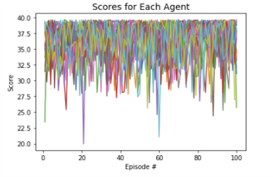
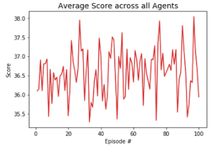

[//]: # "Image References"

[image1]: https://user-images.githubusercontent.com/10624937/43851024-320ba930-9aff-11e8-8493-ee547c6af349.gif "Trained Agent"

# Continuous Control - Actor Critic Methods

### Introduction

This report describes the learning algorithm. It also provides the details of the implementation, along with ideas for future work.

### Environment

For this project, we will work with the [Reacher](https://github.com/Unity-Technologies/ml-agents/blob/master/docs/Learning-Environment-Examples.md#reacher) environment.

![Trained Agent][image1]

In this environment, a double-jointed arm can move to target locations. A reward of +0.1 is provided for each step that the agent's hand is in the goal location. Thus, the goal of the agent is to maintain its position at the target location for as many time steps as possible.

The observation space consists of 33 variables corresponding to position, rotation, velocity, and angular velocities of the arm. Each action is a vector with four numbers, corresponding to torque applicable to two joints. Every entry in the action vector should be a number between -1 and 1.

### Learning Algorithm

The project implements the [Deep Deterministic Policy Gradients (DDPG)](https://arxiv.org/pdf/1509.02971.pdf_) algorithm to train the agent. I decided to go for the Version 2 of the Environment that uses 20 agents. For the purpose of training, the average score required to solve the environment was increased to +32.

__Network Architectures__

The Actor and Critic are both implemented using deep neural networks. Both networks include the Input Layer, 2 Hidden Layers and the Output layer. The DDPG implementation requires a target and local network for both Actor and Critic. The local network represents the actual actor and critic networks while the target networks are used to train the local networks. The target and local networks have the same model architecture.

_Actor Model_

The Pytorch model for the Actor is:

The first hidden layer size is 256 and is followed by a Batch Normalization layer and a ReLU activation function. the second layer size is 128 and is followed by a ReLU activation function. The output layer has 4 outputs, 1 for each action, with a tanh function. The tanh function ensures that the network output is within range (-1, +1)  in line with the action values range.

_Critic Model_

The Pytorch model for the Critic is: 

The first hidden layer receives only the State and like the actor model, has a size of 256 and is followed by a Batch Normalization layer and a ReLU activation function. The output of the first hidden layer is concatenated with the actions input and this combined tensor is the input to the second hidden layer. This second hidden layer has a size of 128 and is followed by ReLU activation function. Finally the output layer has 1 output and no activation function as the output value represents the Q-value for the corresponding input state and actions. 

__Noise Model__

In order to train the network, noise is added to the actions output from the Actor's local network. The noise is modelled with [Ornstein-Uhlenbeck process](https://en.wikipedia.org/wiki/Ornstein%E2%80%93Uhlenbeck_process). A decay is applied to this noise in order to reduce the exploration of the agent in later episodes.  

Three slightly different implementations of the process were tried to train the project, though, the final submission here only includes the implementation that gave the best results. The first implementation was taken from Udacity's [DRLND GitHub repository](https://github.com/udacity/deep-reinforcement-learning). This suffered from significant bias towards positive values and resulted in poor training. The second implementation was an update to the random value generator by subtracting 0.5 in order to centre the results around 0.0. This slightly improved training but still was not sufficient to solve the environment. The final implementation included two improvements - first, the replacement of the random value generator with a generator that draws samples from a standard Normal distribution, and second, generating a different noise sample for each agent as opposed to applying same noise to all agents in the first two implementations. 

The final implementation was a game changer and resulted in a very fast training of the agent. The agent was able to solve the environment in 12 episodes, that is the average score across all agents from episodes 13 to 112 was greater than 32.

More details about the three implementations can be found in Section 8 of `Continuous_Control.ipynb`. This section includes statistics around these implementations.

__Hyperparameters__

These are the hyperparameters used for solving the environment:

_Training Hyperparameters_

* BUFFER_SIZE: 100,000	# the replay buffer size
* BATCH_SIZE = 128           # minibatch size
* GAMMA = .99                   # discount factor
* TAU = 1e-3                       # for soft update of target parameters
* LR_ACTOR = 1e-4            # learning rate of the actor
* LR_CRITIC = 1e-3             # learning rate of the critic
* WEIGHT_DECAY = 0        # L2 weight decay
* UPDATE_EVERY = 10       # Number of time steps to update the network
* UPDATE_TIMES = 10        # Number of times to update the network each time UPDATE_EVERY time steps are reached
* seed = 2                             # random seed

_Noise Parameters_

* EPSILON = 1.0                   # starting value of epsilon to apply decay to the noise process 
* EPSILON_DECAY = 1e-6   # decay rate for epsilon (subtracted for each time step)
* mu = 0.0                             # starting value of the mean of the noise sample
* theta = 0.2                         # theta parameter
* sigma = 0.25                      # sigma parameter

_Actor Network_

* fc1_units = 256 	             # First hidden layer size
* fc2_units = 128                  # Second hidden layer size

_Critic Network_

* fcs1_units = 256 	             # First hidden layer size
* fc2_units = 128                  # Second hidden layer size

### Plot of Rewards

__Training__

Here's the plot of the rewards across 20 agents per episode during the training period:

The agent was able to solve the environment in 12 episodes, that is the average score across all agents from episodes 13 to 112 was greater than 32.

__Testing__

The trained actor and critic agents are loaded from their respective saved checkpoint files. The agent is then tested over 100 episodes, again with the environment using 20 agents.

The mean score across all agents from these 100 episodes is 36.57, which is well above the +30 score needed to learn the environment.

These are the scores from 100 episodes:

### Ideas for Future Work

The DDPG algorithm has been used to train the Unity Agent, Reacher. The environment was learned using 20 identical agents. 

To further improve the agent's performance, we can further optimize the training of the agent using different hyperparameters while also changing the network architecture for Actor and Critic networks. We can also try other reinforcement learning algorithms such as :

* Proximal Policy Optimization (PPO)
* [Distributed Distributional Deterministic Policy Gradients (D4PG)](https://openreview.net/forum?id=SyZipzbCb) 
* Trust Region Policy Optimization (TRPO)
* Truncated Natural Policy Gradient (TNPG)
* Advantage Actor Critic Algorithm (A2C)
* Generalized Advantage Estimation Algorithm (GAE)

Finally, the learnings from this project can be applied to solve more difficult continuous control environments. The README file includes details of one such environment, Crawl. 