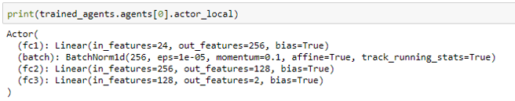
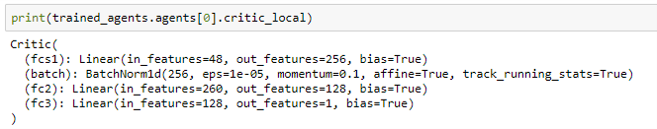
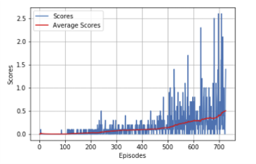
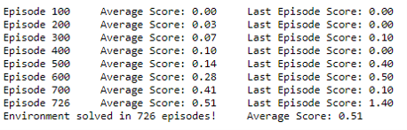
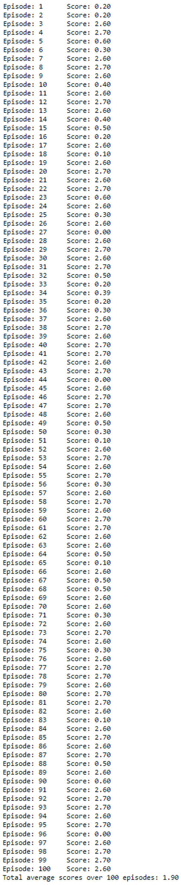
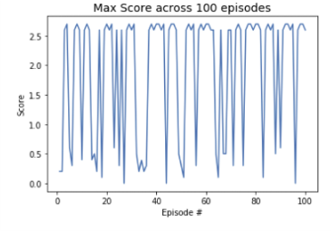

[//]: # "Image References"

[image1]: https://user-images.githubusercontent.com/10624937/42135623-e770e354-7d12-11e8-998d-29fc74429ca2.gif "Trained Agent"

# MultiAgent Tennis - Collaboration and Competition

### Introduction

This report describes the learning algorithm. It also provides the details of the implementation, along with ideas for future work.

### Environment

For this project, we will work with the [Tennis](https://github.com/Unity-Technologies/ml-agents/blob/master/docs/Learning-Environment-Examples.md#tennis) environment.

![Trained Agent][image1]

In this environment, two agents control rackets to bounce a ball over a net. If an agent hits the ball over the net, it receives a reward of +0.1. If an agent lets a ball hit the ground or hits the ball out of bounds, it receives a reward of -0.01. Thus, the goal of each agent is to keep the ball in play.

The observation space consists of 8 variables corresponding to the position and velocity of the ball and racket. Each agent receives its own, local observation. Two continuous actions are available, corresponding to movement toward (or away from) the net, and jumping.

The task is episodic, and in order to solve the environment, your agents must get an average score of +0.5 (over 100 consecutive episodes, after taking the maximum over both agents). Specifically,

- After each episode, we add up the rewards that each agent received (without discounting), to get a score for each agent. This yields 2 (potentially different) scores. We then take the maximum of these 2 scores.
- This yields a single **score** for each episode.

The environment is considered solved, when the average (over 100 episodes) of those **scores** is at least +0.5.

### Learning Algorithm

The project implements the [Multi-Agent Deep Deterministic Policy Gradients (MADDPG)](https://arxiv.org/abs/1706.02275) algorithm to train the agent. MADDPG is a multi-agent actor-critic algorithm for mixed cooperative-competitive environments. It is an extension of [Deep Deterministic Policy Gradients (DDPG)](https://arxiv.org/pdf/1509.02971.pdf) algorithm to the multi-agent setting.

Here is the algorithm for MADDPG from the original paper:

__Key components of MADDPG for N Agents__

- ***Actor-critic architecture*** with two elements, actor and critic.
  - Deterministic actor (policy) for each agent, where actor function only has access to local information (i.e. agent's own observations / state).
  - Centralized critic (action-value) function that explicitly uses the decision-making policies (a1,..., a*N*;) of each agent in addition to the all their
    observation (x, x'). So the critic has access to states and actions of all agents.
- As in Deep Q-network to adapt the Q-learning algorithm in order to make effective use of large neural networks as function approximators and avoid instability of learning are used two important techniques:
  - _**Shared** Experience Replay_: The actor and critic networks are trained off-policy with samples uniformly from replay buffer to minimize correlations between samples. The experiences are shared by all the agents.
  - Separate target network: The critic network is trained with both actor and critic target networks to give consistent target values during temporal difference backups.
- ***Random noise process for action exploration***: Add noise sampled from *Ornstein-Uhlenbeck process* to actor policy.
- ***“Soft” target updates***: The weights of targets networks are updated by having them slowly track the learned networks, so the target values are constrained to change slowly, greatly improving the stability of learning.
- Estimate the weights of an actor policy through gradient ascent.
- Estimate the weights of a critic network through gradient descent.

__Network Architectures__

The algorithm is implemented in `maddpg_agent.py` and starts with the MultiAgent Class. This class includes all the essential functions that are used during training in `Training.ipynb`. The MultiAgent class creates individual agents using the Agent class. The Agent class includes the methods for providing an action for a given state as well as the training algorithm for the respective agent. The agent is implemented using an actor and critic network, for both local and target networks, and so there are 4 deep neural networks for each agent.

The Actor and Critic are both implemented using deep neural networks, and scripted in `model.py`. Both networks include the Input Layer, 2 Hidden Layers and the Output layer. The MADDPG (and DDPG) implementation requires a target and local network for both Actor and Critic. The local network represents the actual actor and critic networks while the target networks are used to train the local networks. The target and local networks have the same model architecture.

_Actor Model_

The Pytorch model for the Actor is:

The first hidden layer size is 256 and is followed by a Batch Normalization layer and a ReLU activation function. the second layer size is 128 and is followed by a ReLU activation function. The output layer has 4 outputs, 1 for each action, with a tanh function. The tanh function ensures that the network output is within range (-1, +1)  in line with the action values range.

_Critic Model_

The Pytorch model for the Critic is: 

The first hidden layer receives only the State and like the actor model, has a size of 256 and is followed by a Batch Normalization layer and a ReLU activation function. The output of the first hidden layer is concatenated with the actions input and this combined tensor is the input to the second hidden layer. This second hidden layer has a size of 128 and is followed by ReLU activation function. Finally the output layer has 1 output and no activation function as the output value represents the Q-value for the corresponding input state and actions. 

One key difference in the inputs to the Critic Model is that the state and actions inputs include the observations and actions of all agents, unlike the Actor Model which was provided the state and action of that agent only. This implies that the inputs to the Critic Model are bigger in size (Number of multiple agent times bigger) and so the input data needs to be shaped accordingly and carefully.

__Noise Model__

In order to train the network, noise is added to the actions output from the Actor's local network. The noise is modelled with [Ornstein-Uhlenbeck process](https://en.wikipedia.org/wiki/Ornstein%E2%80%93Uhlenbeck_process). A decay is applied to this noise in order to reduce the exploration of the agent in later episodes.  

Three slightly different implementations of the process have previously been tried in Section 8 of `Continuous_Control.ipynb` in [Continuous Control - Actor Critic Methods](https://github.com/udaygoel/Deep-Reinforcement-Learning/tree/master/Continuous%20Control%20-%20Actor%20Critic%20Methods) project. We have used the final implementation that uses the normal distribution to produce noise samples.

__Hyperparameters__

These are the hyperparameters used for solving the environment:

_Training Hyperparameters_

* BUFFER_SIZE: 100,000	# the replay buffer size
* BATCH_SIZE = 128           # minibatch size
* GAMMA = .99                   # discount factor
* TAU = 1e-3                       # for soft update of target parameters
* LR_ACTOR = 1e-4            # learning rate of the actor
* LR_CRITIC = 1e-3             # learning rate of the critic
* WEIGHT_DECAY = 0        # L2 weight decay
* UPDATE_EVERY = 10       # Number of time steps to update the network
* UPDATE_TIMES = 10        # Number of times to update the network each time UPDATE_EVERY time steps are reached
* seed = 2                             # random seed

_Noise Parameters_

* EPSILON = 1.0                   # starting value of epsilon to apply decay to the noise process 
* EPSILON_DECAY = 1e-6   # decay rate for epsilon (subtracted for each time step)
* mu = 0.0                             # starting value of the mean of the noise sample
* theta = 0.2                         # theta parameter
* sigma = 0.25                      # sigma parameter

_Actor Network_

* fc1_units = 256 	             # First hidden layer size
* fc2_units = 128                  # Second hidden layer size

_Critic Network_

* fcs1_units = 256 	             # First hidden layer size
* fc2_units = 128                  # Second hidden layer size

### Plot of Rewards

__Training__

Here's the plot of the rewards (maximum value across both agents) during the training period:

The blue plot is the reward per episode and the red plot is average of rewards over the previous 100 episodes.

The agent was able to solve the environment in 726 episodes.

__Testing__

The trained actor and critic models for both agents are loaded from their respective saved checkpoint files. The agents are then tested over 100 episodes. We no longer apply noise to the actions of the actor models.

The mean score from these 100 episodes is 1.90, which is well above the +0.5 score needed to learn the environment.

These are the scores from 100 episodes:

    

   

### Ideas for Future Work

The MADDPG algorithm has been used to train the Unity Agent, Tennis. The environment used 2 agents to play the tennis game. 

To further improve the agent's performance, we can further optimize the training of the agent using different hyperparameters while also changing the network architecture for Actor and Critic networks. We can also use Prioritized Experience Replay for more robust training.

The design of the reward function in this environment encourages the agents to collaborate in order to achieve a high score. The agents are concerned about achieving a high score and not about learning strategies to win the game. It doesn't matter which agent wins as long as the score is high. In future work, the reward function can be changed such that it gives a higher score for winning and not just for crossing the ball over the net. This will encourage the agents to learn strategies to win the game.

Finally, the learnings from this project can be applied to solve more difficult multi-agent environments. The README file includes details of one such environment, Soccer. 