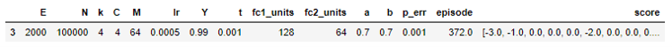
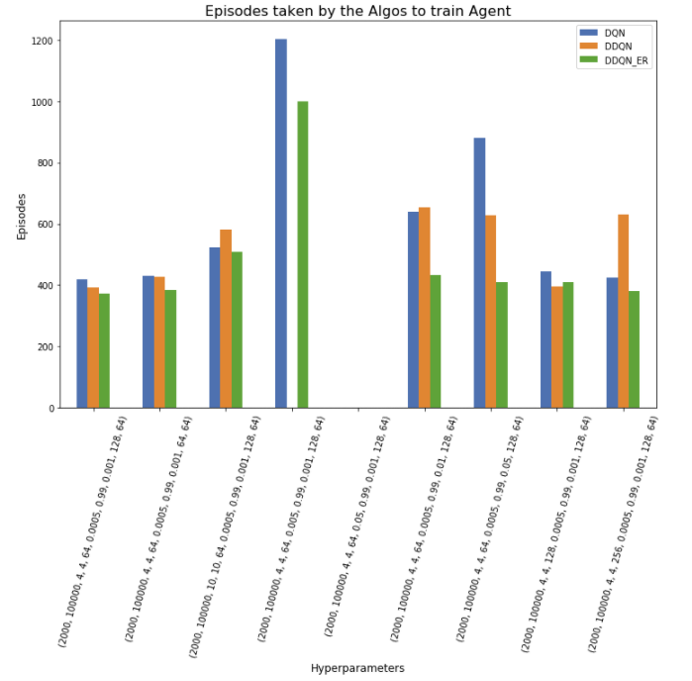
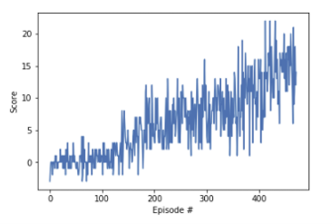
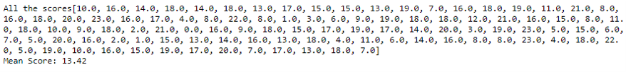
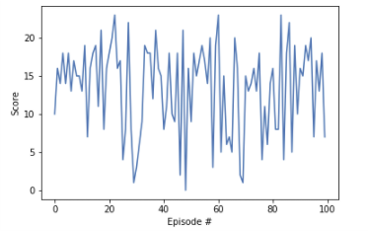

# Navigation - Value based methods

### Introduction

This report describes the learning algorithm. It also provides the details of the implementation, along with ideas for future work.

### Environment

In this project, we train an agent to navigate (and collect bananas!) in a large, square world.  

A reward of +1 is provided for collecting a yellow banana, and a reward of -1 is provided for collecting a blue banana.  Thus, the goal of the agent is to collect as many yellow bananas as possible while avoiding blue bananas.  

The state space has 37 dimensions and contains the agent's velocity, along with ray-based perception of objects around agent's forward direction.  Given this information, the agent has to learn how to best select actions.  Four discrete actions are available, corresponding to:

- **`0`** - move forward.
- **`1`** - move backward.
- **`2`** - turn left.
- **`3`** - turn right.

The task is episodic, and in order to solve the environment, the agent must get an average score of +13 over 100 consecutive episodes.

### Learning Algorithm

The project looks at 3 different algorithms of value-based methods to train the agent. In all cases, the Q-value function approximator is implemented as a 3 layer Feed Forward Neural Network. The 3 layers include Input Layer, 1 Hidden Layer and Output Layer.  The algorithms implemented are:

1. Deep Q-Network (DQN)
2. Double Deep Q-Network (DDQN)
3. DDQN and Prioritized Experience Replay (PER)

For each algorithm, we try different combinations of hyperparameter values to identify the set of hyperparameter values that achieve the fastest training. The sizes of the Input Layer and the Hidden Layer are also hyperparameters. The code inputs these hyperparameters by reading a "hyperparameters.csv" file to a pandas dataframe and iterates through each row in the dataframe. Here is a list of the hyperparameters that can be changed:

* E: Number of episodes for training. This is not really a hyperparameter but is still provided to give the user more flexibility.
* N: Memory size / Buffer size. Used for PER.
* k: Frequency of training. That is, the number of steps after which to train the agent.
* C: Frequency of updating the weights for Target Q Network. This is used for DDQN.
* M: Batch Size for sampling memory and training
* lr: Learning Rate
* Y: Gamma as the decay rate for rewards
* t: Tau for target Q network parameters updated. Used for DDQN
* fc1_units: Number of nodes in the Input Layer
* fc2_units: Number of nodes in the Hidden Layer
* a: `a` parameter for PER
* b: `b` parameter for PER
* p_err: priority error term for PER

DQN and DDQN implementations, each, use 9 different combinations of the hyperparameter values

DDQN + PER implementation uses 5 combinations of values for (a, b, p_err) for each of the 9 hyperparameter values combinations used by DQN and DDQN. So, this implementation uses 45 different combinations in total. Since training with all 45 combinations takes a very long time, these parameters were split into 5 parts - 4 parts have 10 combinations each and the 5th part has 5 combinations. 

The results of these 63 (9 + 9 + 45) combinations are then compared in 4 steps:

1. The results of the DDQN+PER are first studied. Remember, we use 5 combinations of values for (a, b, p_err) for each of the 9 hyperparameter values combinations used by DQN and DDQN. In this step, we find the values of (a, b, p_err) that give the fastest training (the smallest episode to complete training) out of the 5 combinations. This reduces the results from a 45 row dataframe to a 9 row dataframe and allows us to compare the results with DQN and DDQN implementations. We can now check in next step the benefit PER added to the training by using the 9 row dataframe. In cases where the agent does not complete training within the 2000 episodes (hyperparameter E), the "episode" value is NaN. 

   

2. We combine the results of the 3 implementations. We keep track of the algo used by using 3 boolean columns, one each for DQN("dqn"), DDQN("ddqn") and PER("er"). The columns work as below: 

   - For DQN implementation, dqn column is True and rest are false.

   - For DDQN implementation, ddqn column is True and rest are false.

   - For DDQN+PER implementation, ddqn and er columns are True and dqn is false.

     

3. We now have a total of 27 results. We can query these for the row with the minimum number of episodes required for training - the fastest training amongst all hyperparameter combinations. This turns out to be a DDQN+PER implementation and requires just 372 episodes to complete the training. Below are the hyperparameters used for the training (ignore episode and score columns):

   

   

4.  We can take the above 27 results and draw a plot to compare the performance of the 3 implementations. We do this by creating a vertical bar chart with the combinations of hyperparameters on the x-axis and the number of episodes required to train on the y-axis. The results are plotted for each implementation. This chart can be seen below:

We can make some observations from this chart:

* DDQN+PER always performs best except in 1 case (see second from right) but even here it is a close second
* DDQN does not always perform better than DQN. In one case, DDQN doesn't learn but DQN does
* When learning rate is high (0.05), none of the implementations are able to train the agent.
* For the one case, where DQN trains the agent but DDQN doesn't, DDQN+PER is still able to train. DDQN+PER actually trains faster than DQN. This shows that the experience replay can lead to robust training. 

### Plot of Rewards

__Training__

We plot the rewards per episode for the model that trained with the least number of episodes. This model took 372 episodes to train. 

Here's the plot of the rewards per episode during the training period:

__Testing__

This model is then loaded from the saved checkpoint file 'checkpoint_ddqn_er_4.pth' to the agent's local Q-Network. The agent is then tested over 100 episodes with the environment in evaluation mode, i.e., train_mode = False

The mean score from these 100 episodes is 13.42, which is above the +13 score needed to learn the environment in training mode.

These are the scores from 100 episodes as a list and in a chart plot:

### Ideas for Future Work

This project has tested 3 different algorithms to train the agent. There are other value based methods that can also be used for training:

* Dueling DQN
* Learning from Multi-step bootstrap targets
* Distributional DQN
* Noisy DQN
* Rainbow - this is a combination of above 4, DDQN and PER.

Each of the 6 extensions of the DQN network address a different issue with the original DQN algorithm. 

In future work, all these extensions can be tried, either alone or in different combinations, to achieve even faster training.

Another improvement could be to raise the threshold for solving environment from +13 to higher numbers, such as 16 or more. Different algorithms and hyperparameter combinations can be used to train the agent. This trains an agent with an even higher score. We may also see a bigger difference in performance (number of episodes) between the algorithms (or combinations of) as we raise the bar higher to solve the environment. We may find that some algorithms (or combinations of) just do not train the agent within a given number of episodes.

Finally, a more challenging task would be to learn directly from pixels. In this project, the agent learned from information such as its velocity, along with ray-based perception of objects around its forward direction. In learning directly from pixels, the environment will be _almost_ identical to the project environment, where the only difference is that the state is an 84 x 84 RGB image, corresponding to the agent's first-person view of the environment. To solve this environment, we will need to design a convolutional neural network as the DQN architecture. 

To solve this harder task, you will need to download a new Unity environment. You need only select the environment that matches your operating system:

* Linux: [click here](https://s3-us-west-1.amazonaws.com/udacity-drlnd/P1/Banana/VisualBanana_Linux.zip)
* Mac OSX: [click here](https://s3-us-west-1.amazonaws.com/udacity-drlnd/P1/Banana/VisualBanana.app.zip)
* Windows (32-bit): [click here](https://s3-us-west-1.amazonaws.com/udacity-drlnd/P1/Banana/VisualBanana_Windows_x86.zip)
* Windows (64-bit): [click here](https://s3-us-west-1.amazonaws.com/udacity-drlnd/P1/Banana/VisualBanana_Windows_x86_64.zip)

Then, place the file in the `p1_navigation/` folder in the DRLND GitHub repository, and unzip (or decompress) the file.

(_For AWS_) If you'd like to train the agent on AWS, you must follow the instructions to [set up X Server](https://github.com/Unity-Technologies/ml-agents/blob/master/docs/Training-on-Amazon-Web-Service.md), and then download the environment for the __Linux__ operating system above.